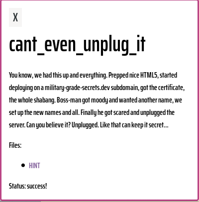
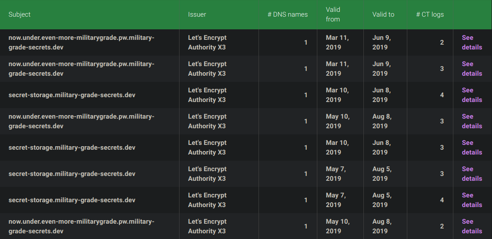
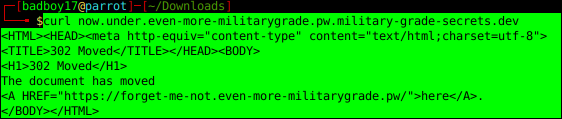
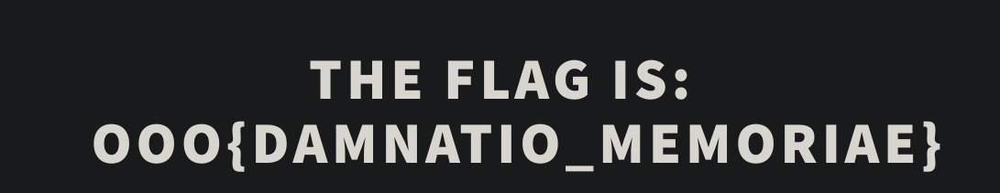

# Defcon Quals 2019

## Can't Even Unplug It

## Difficulty: Easy

## Category: Web( kinda...)

## Writeup:

No CTF's from a month and well now it was time for Defcon Quals. This was the first and only chall which I captured except from the Welcome One(:P).

So this one had all nice and big description n everything including a HINT :)

>Hint: these are HTTPS sites. Who is publicly and transparently logging the info you need? Just in case: all info is freely accessible, no subscriptions are necessary. The names cannot really be guessed.

So everything that was needed to complete this challenge was in the hint. So what I did was scanned the subdomains for other subdomains which was pretty much transparent in the certificate. I used Google's Certificate lookup.
>https://transparencyreport.google.com/https/certificates

Now the curl gave a pretty output.

A 302 ....Huh!...but couldn't find a way to get to the URL. Then an idea of archives stumbled (maybe the webpage was archived-The unplugged thing in Description) **Web_Archives**. Entered the URL there n all there was a OOO{} FLAG. 

So that was the CA challenge.

Thanks for reading.